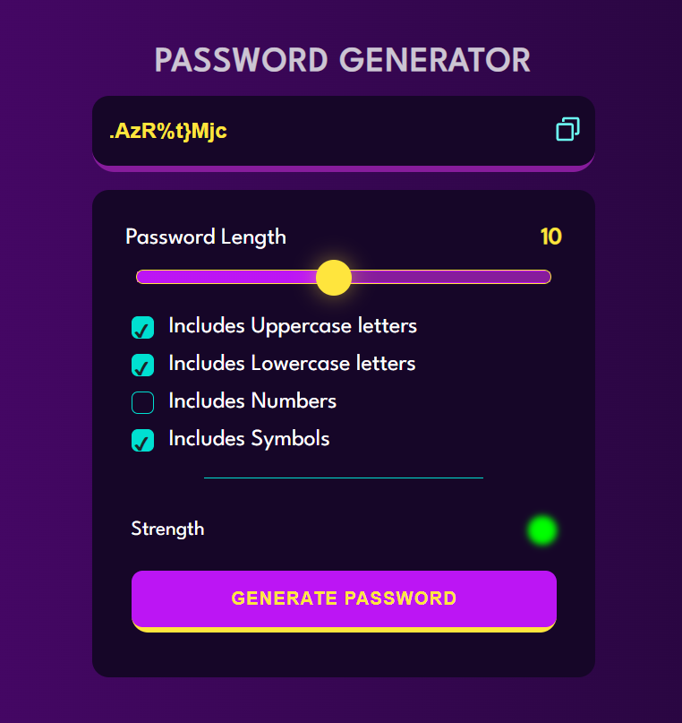

This is a web application that generates unique passwords with different combinations of uppercase letters, lowercase letters, numbers, and symbols. The user can customize the length of the password and select which character sets to include in the generated password.

## Usage

The user interface is designed to be simple and intuitive. The user can select the desired length of the password by moving the slider. The user can also select which character sets to include by checking the corresponding checkboxes.

Once the user is satisfied with their selection, they can click on the "GENERATE PASSWORD" button to generate a new password. The generated password will appear in the text area.

The user can copy the password to their clipboard by clicking the copy icon. The password will automatically be copied to the clipboard, and a message will appear briefly to confirm that the password has been copied.

## Technologies Used

This project is built using HTML, CSS, and JavaScript.

## Installation

There is no installation required for this project. The web application is hosted on GitHub Pages, and can be accessed using the following link:

https://imaditya05.github.io/password-generator/

## Contributing

If you would like to contribute to this project, feel free to fork the repository and submit a pull request. Any contributions are greatly appreciated!

## Credits

This project was created by [Aditya Gupta](https://github.com/imaditya05).

## License

This project is licensed under the [MIT License](https://opensource.org/licenses/MIT).
